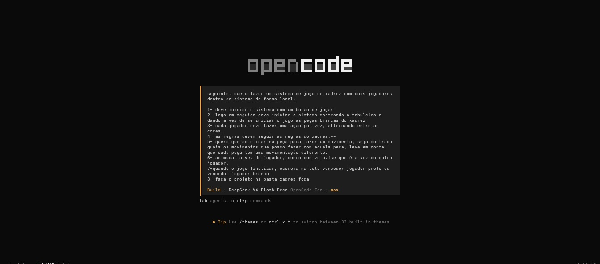

# xadrez_foda

## 1. O que o projeto faz

Jogo de xadrez para dois jogadores, 100% local, rodando no navegador (HTML/CSS/JS puro, sem dependências). Implementa as regras completas do xadrez: movimentação de todas as peças, roque, en passant, xeque, xeque-mate e afogamento, com indicação dos movimentos possíveis ao clicar numa peça, aviso de troca de turno e exibição do vencedor ao final da partida.

**Opção escolhida:** projeto pessoal.

## 2. System prompt usado (completo)

```
seguinte, quero fazer um sistema de jogo de xadrez com dois jogadores dentro do sistema de forma local.

1- deve iniciar o sistema com um botao de jogar
2- logo em seguida deve iniciar o sistema mostrando o tabuleiro e dando a vez de se iniciar o jogo as peças brancas do xadrez
3- cada jogador deve fazer uma ação por vez, alternando entre as cores.
4- as regras devem seguir as regras do xadrez.==
5- quero que ao clicar na peça para fazer um movimento, seja mostrado quais os movimentos que posso fazer com aquela peça, leve em conta que cada peça tem uma movimentação diferente.
6- ao mudar a vez do jogador, quero que vc avise que é a vez do outro jogador.
7-quando o jogo finalizar, escreva na tela vencedor jogador preto ou vencedor jogador branco
8- faça o projeto na pasta xadrez_foda
```

Ferramenta: OpenCode (CLI) com modelo `deepseek-v4-flash-free`.

## 3. Técnica aplicada: Chain-of-Thought + Task Decomposition

O prompt já foi enviado estruturado em 8 requisitos numerados (decomposição da tarefa em subtarefas: iniciar o jogo, tabuleiro, alternância de turnos, regras, highlight de movimentos, aviso de vez, fim de jogo e localização do projeto). O modelo, por sua vez, raciocinou passo a passo (chain-of-thought): criou os arquivos, validou a sintaxe, escreveu um harness de testes automatizados com 36 casos cobrindo abertura, en passant, roque, xeque, mate e afogamento, depurou bugs encontrados e só então finalizou.

**Por que essa técnica:** a decomposição garante que cada requisito seja tratado isoladamente, reduzindo o risco de regra esquecida; o raciocínio em cadeia permitiu ao modelo encontrar e corrigir um bug real (verificação de xeque usava a posição original do rei ao mover o rei), o que não aconteceria com uma resposta única direta.

<!-- EVIDÊNCIA: print da sessão mostrando o prompt em 8 requisitos e a execução passo a passo (validação de sintaxe, testes, depuração). -->

<!-- EVIDÊNCIA: print dos testes automatizados passando (36 pass). -->

## 4. Teste de curadoria de contexto (arquivo inteiro vs. trecho)

<!-- EVIDÊNCIA: print da chamada A (arquivo inteiro) com contagem de tokens. -->
<!-- EVIDÊNCIA: print da chamada B (trecho) com contagem de tokens. -->

| Versão do prompt | Tokens de entrada | Tokens de saída | Total |
|---|---|---|---|
| Arquivo inteiro | 23.352 | 47.913 | 71.265 |
| Trecho | 14.924 | 4.336 | 19.260 |

## 5. Tabela de chamadas da sessão

Custo estimado simulado com a tabela de preços do DeepSeek V3 (US$ 0,27/M input, US$ 1,10/M output, US$ 0,07/M cache read), já que a ferramenta usada (OpenCode + deepseek-v4-flash-free) não cobra por chamada.

| # | Tokens de entrada | Tokens de saída | Cache read | Custo estimado |
|---|---|---|---|---|
| 1 | 15.920 | 425 | 0 | US$ 0,004766 |
| 2 | 274 | 29.496 | 16.128 | US$ 0,033649 |
| 3 | 597 | 1.376 | 45.312 | US$ 0,004847 |
| 4 | 195 | 3.637 | 47.104 | US$ 0,007351 |
| 5 | 263 | 148 | 50.688 | US$ 0,003782 |
| 6 | 170 | 1.948 | 50.944 | US$ 0,005755 |
| 7 | 2.132 | 53 | 50.944 | US$ 0,004200 |
| 8 | 250 | 3.747 | 52.992 | US$ 0,007899 |
| 9 | 425 | 73 | 56.576 | US$ 0,004155 |
| 10 | 314 | 3.356 | 56.832 | US$ 0,007755 |
| 11 | 867 | 54 | 59.648 | US$ 0,004469 |
| 12 | 321 | 2.249 | 60.416 | US$ 0,006790 |
| 13 | 791 | 420 | 62.208 | US$ 0,005030 |
| 14 | 201 | 279 | 63.232 | US$ 0,004787 |
| 15 | 238 | 149 | 63.488 | US$ 0,004672 |
| 16 | 153 | 196 | 63.744 | US$ 0,004719 |
| 17 | 241 | 307 | 64.000 | US$ 0,004883 |
| **Total** | **23.352** | **47.913** | **864.256** | **US$ 0,119507** |

## 6. Dashboard/log da ferramenta



## 7. URL publicada

Repositório: https://xadrez-foda.onrender.com/

## 8. Integrantes

| Nome | RA |
|---|---|
| Eduardo Escudeiro Seifert | 23034738-2 |
| Pedro Henrique dos Santos Manfrim | 23079481-2 |
| Daniel Rodrigues Nardi | 23159251-2 |
